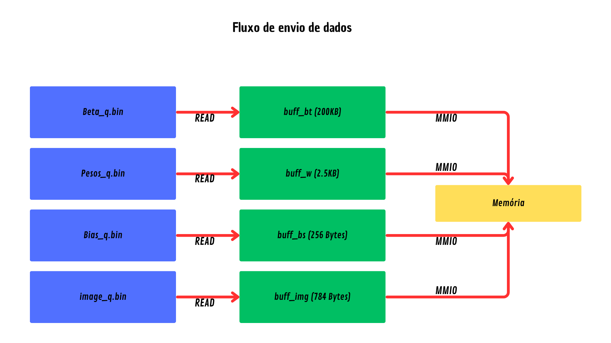
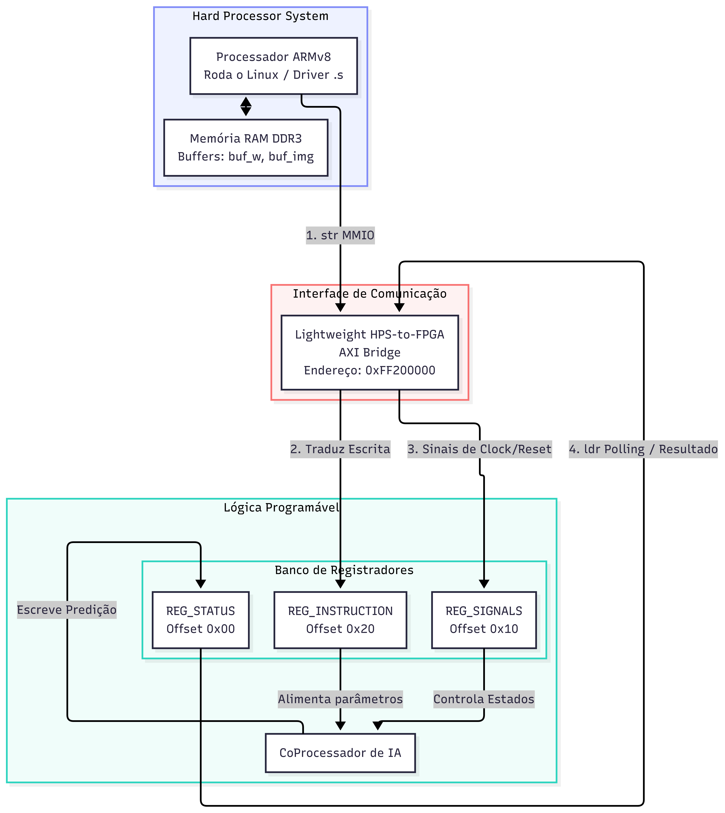

# Especificações do Driver
Este é um Driver Kernel Linux, escrito em Assembly para ARMv8. O Programa integra, através da HPS da Altera, o processador da placa De1-SoC e o CoProcessador de Maike.  
	
O Driver foi feito para máquinas Linux, baseadas em ARMv8, sem contar a necessidade da placa equipada com o coprocessador em questão.

O CoProcessador tem a função definida de receber uma imagem de um número, dentre as separadas e retornar uma inferência de qual número está escrito nessa imagem. Ao mesmo tempo, o coprocessador também retorna o seu estado (Done, Busy ou Error)
	
O programa consiste em um arquivo .s (Código em Assembly), um arquivo .h (Arquivo de definição dos registradores) e um .c (Importação do programa e visualização das saídas).
# Fundamentação Teórica
1. MMIO
   - A Memory-Mapped I/O (MMIO), ou Entrada/Saída Mapeada em Memória, é um método fundamental de comunicação entre o processador (CPU) e os dispositivos periféricos (como placas de vídeo, placas de rede e controladores de armazenamento) em uma arquitetura de computadores.
   - Em termos teóricos, o MMIO unifica o espaço de endereçamento do sistema, fazendo com que o acesso ao hardware seja tratado exatamente da mesma forma que o acesso à memória RAM.
     
2. HPS Altera
   - A Hard Processor System (HPS) é uma contraparte teórica e arquitetural fundamental no universo dos sistemas digitais modernos, especialmente no contexto de chips híbridos conhecidos como SoCs FPGAs (como as famílias Cyclone V SoC, Arria 10 SoC da Intel/Altera, ou os equivalentes Zynq da AMD/Xilinx, onde o conceito é análogo).
   - Em termos teóricos, o HPS representa a fusão de dois paradigmas de computação historicamente distintos no mesmo substrato de silício: a computação baseada em software (execução sequencial) e a computação baseada em hardware (execução paralela).
     
3. AXI Bridge
   - A AXI Bridge (Ponte AXI) é o elemento arquitetural e teórico que viabiliza a existência de sistemas híbridos, como os SoCs FPGAs. Ela atua como um tradutor e um canal de comunicação de alta velocidade que interconecta o mundo do hardware fixo (o HPS ou processador dedicado) ao mundo da lógica programável (a FPGA).
   - Sem essa ponte, o processador e a FPGA seriam dois componentes isolados dividindo o mesmo silício; com ela, eles passam a operar como um sistema unificado.
     
5. Endianess
   - Endianness é o conceito que define a ordem em que os bytes de um dado numérico composto por múltiplos bytes são organizados e armazenados na memória de um computador ou transmitidos através de uma rede. Quando lidamos com dados maiores que um byte, como números inteiros de 16, 32 ou 64 bits, a arquitetura do processador precisa seguir uma regra fixa para saber qual byte vem primeiro.
     
   - No sistema Big-Endian, o byte mais significativo, que é aquele que carrega o maior valor numérico (como as centenas ou milhares em nossa escrita manual), é guardado no menor endereço de memória. Funciona exatamente como a escrita humana ocidental, onde lemos e escrevemos os números da esquerda para a direita, começando pelo algarismo de maior valor.
     
   - No sistema Little-Endian, ocorre o inverso: o byte menos significativo, que carrega o menor valor numérico (as unidades), é armazenado no menor endereço de memória. Para um observador humano que analisa a memória de forma sequencial, o número parece estar invertido, mas essa abordagem traz vantagens de desempenho para os circuitos eletrônicos do hardware, que podem começar a processar operações matemáticas básicas de forma mais direta.
     
# Metodologia
- Entradas: O CoProcessador deve receber as entradas do seu sistema, essas sendo o arquivo da imagem, o arquivo de pesos e o arquivo dos viéses, além dos bits da instrução, já que o CoProcessador só vai carregar, calcular ou enviar, após receber a instrução de 32bits relacionada.

- Saídas: O CoProcessador retorna, além de seu estado, o resultado da predição, encontrado após a inferência.
Sabendo disso, nosso objetivo era criar um Driver que poderia receber os dados dos arquivos de imagens, pesos e viéses, e direcioná-los ao CoProcessador, mesmo sem ter acesso ao que acontece dentro do mesmo. Para isso, nosso primeiro problema foi entender como que o CoProcessador poderia receber esses dados, sendo que não tinhamos acesso ao seu conteúdo.

1. A Comunicação
   - Leitura dos arquivos
     
     Já que tinhamos os arquivos prontos, e os bits de cada instrução já estavam definidos, nós precisávamos definir como o Driver iria ler esses dados. O caminho que escolhemos, foi usar o comando svc (systemcall), para direcionar o driver ao diretório onde os arquivos estavam, para que os registradores que definimos pudessem receber os dados.
     
     Para testar, enviamos os arquivos e pedimos uma saída que possuia relação com eles, por exemplo, os 16 primeiros bits do arquivo.
     
    ```bash 
    mov  r4, r0         ← salva o fd aberto
	ldr  r1, =buf_w     ← endereço do buffer na RAM do HPS (destino)
	mov  r2, #200704    ← quantos bytes ler
	mov  r7, #3         ← syscall read()
	svc  0              ← kernel lê o arquivo e despeja direto no buffer
    ```
    
    - Envio dos dados
      
      Como foi dito, não existe um meio direto do Driver falar com o CoProcessador, já que um não tem acesso ao outro, então foi necessário o uso dos endereços da HPS, que ambos possuem acesso, para que essa comunicação ocorra. O Driver lê os arquivos em seus diretórios e os registradores escrevem os dados em um buffer, através de um loop, já que não era possível escrever todos os dados em somente um ciclo, ou em uma instrução.

      Esse buffer possui tamanho definido no código a partir do arquivo que ele vai receber, e já é uma parte (endereço) da memória dessa HPS, então quando os arquivos terminam de ser escritos, a parte do Driver já vai ter sido feita.
      
    ```bash
    lsl  r0, r10, #1       ← índice × 2 (cada valor ocupa 2 bytes)
	ldr  r3, =buf_w        ← endereço base do buffer
	ldrh r0, [r3, r0]      ← lê 2 bytes do buffer (um valor de 16 bits)
	rev16 r0, r0           ← corrige endianness antes de enviar
    ```
	
    
    - Como o CoProcessador lê
      
      A HPS redireciona os dados desse endereço, definido por nós como saída do Driver e entrada do CoProcessador, para a porta LW do mesmo, onde os registradores vão direcionar os dados para cada módulo, dependendo do valor dos 32 bits da instrução, para que cada um faça seu papel na resolução.

      A Porta LW é feita para receber esses dados, então apartir desse ponto arquitetura do CoProcessador começa a trabalhar, devolvendo a predição da imagem (saída), após receber todas as instruções e dados.
      
    - Leitura do Resultado
      
      Os Registradores do CoProcessador direcionam o resultado da inferência (saída do sistema), para outro endereço da HPS, esse que foi definido para essa função. Criamos a função de leitura da predição, onde os registradores vão que vai ler aquilo que for escrito nesse endereço, e retornar esse valor para o usuário no terminal.
      
   ```bash
   poll_done:
    ldr  r0, [r9, #0x00]   ← lê o registrador de status da FPGA
    tst  r0, #0x10         ← testa o bit 4 (flag "done")
    beq  poll_done         ← se não terminou, continua lendo
    and  r0, r0, #0xF      ← isola os 4 bits com o dígito predito (0–9)
	```
   - Conexão HPS-AXI-FPGA
     

2. Registradores
   - Tendo como base o banco de registradores descrito na Documentação, criamos um arquivo .h (Header) cuja função é definir os registradores para a camada de implementação (arquivo .c):
     
			int mapear_fpga(void);
			Efetua a abertura de /dev/mem e mapeia uma página física (4KB) usando a chamada de sistema mmap2. Retorna 0 em 				caso de sucesso.

			int reiniciar_fpga(void);
			Aplica um pulso lógico de RESET síncrono para reinicializar a máquina de estados interna da FPGA.

			int carregar_pesos(const char *caminho);
			Carrega os 100.352 pesos em precisão fixa de 16 bits para a memória da FPGA, segmentando em instruções de 					endereço (Opcode 1) e valor (Opcode 2).

			int carregar_beta(const char *caminho);
			Transfere os 1.280 coeficientes beta combinados em palavras de instrução de 32 bits (Opcode 4).

			int carregar_bias(const char *caminho);
			Transfere os 128 valores de bias utilizando o Opcode 3.

			int carregar_imagem(const char *caminho);
			Transfere os 784 pixels de uma imagem digitalizada de entrada utilizando o Opcode 0.

			int iniciar_inferencia(void);
			Dispara o cálculo enviando o sinal operacional de START (Opcode 5).

			int obter_resultado(void);
			Rotina bloqueante baseada em Polling ativo. Interroga o registrador 0x00 até que a flag DONE (bit 4) seja 					levantada, isolando e retornando o dígito classificado nos bits [3:0].

			int ler_status_fpga(void);
			Leitura direta e não-bloqueante do registrador bruto de status e diagnóstico da FPGA.
     
3. Erros encontrados no desenvolvimento
   - O primeiro problema foi na função mapear_fpga: estávamos passando um endereço físico errado para o mmap2. O resultado foi que todas as escritas nos registradores da FPGA iam para uma região inválida do barramento e simplesmente não chegavam ao hardware.
   - O segundo problema foi a Endianness trocada nos arquivos .bin dos parâmetros, que foram gerados em big-endian, embora o ARM trabalhasse em little-endian. Cada valor de 16 bits chegava com os bytes trocados — um bias FBEB virava EBFB, as imagens nao tiveram esse problema, pois cada pixel da imagem corespondia a 8 bits.

A correção foi adicionar rev16 em todos os loops de leitura de parâmetros:

	```asm
	ldrh  r0, [r3, r0]   @ lê 2 bytes do buffer
	rev16 r0, r0         @ corrige a ordem dos bytes
	```
- Houveram problemas na hora de executar pelo terminal, mas esses são por conta da necessidade de uma execução a partir de comandos mais específicos, que estão descritos no Manual de Uso. O sudo su é necessário pois, como descrito anteriormente, o Driver tem acesso ao diretório do arquivo, então ele precisa de acesso root para abrir o /dev/mem — sem isso ele falha logo na primeira chamada. O -no-pie desativa o PIE (Position Independent Executable) para que o linker misture o main.c com o driver.s sem conflito.
  
# Manual de uso
- Faça o Download de todo o conteúdo das pastas data, src e utils;
- Modifique os diretórios e nomes dentro do arquivo main.c, para dar, corretamente para o Driver, acesso aos arquivos;
- Carregue, na placa De1-SoC, o projeto CoProcessador de Maike (https://github.com/DestinyWolf/Problema_SD_2026_1);
- Conecte sua máquina remotamente ao terminal do Processador ARMv7, da De1-SoC;
- Execute no terminal:
```bash
sudo su
gcc main.c driver.s -o elm -I. -no-pie
./elm
```

# Testes e Resultados
1. Testbench
Antes de carregar qualquer parâmetro, o main chama iniciar_inferencia() de propósito, para ver se a FPGA bloqueia o comando. Depois lê o status com imprimir_status(), que decodifica o registrador de hardware e imprime flags legíveis como [BUSY] ou [ERRO];

Exemplo do Terminal:
```bash
==================================================
   TESTBENCH AUTOMATIZADO - ELM CO-PROCESSOR      
==================================================

[TESTE 1] Protecao contra comando precoce e operacao invalida
[STATUS HW] [BUSY] | DATA_OUT: 0x20
    [+] >> DIGITO PREDITO PELA FPGA (Lixo): 0 <<
[+] Sucesso: O hardware bloqueou a escrita e o driver reportou o erro (-99).
[STATUS HW] [ERRO] | DATA_OUT: 0x40

[TESTE 2] Carga de parametros da Rede Neural
-> Enviando Pesos...
-> Enviando Betas...
-> Enviando Bias...
[+] Parametros base carregados com sucesso.

==================================================
   [TESTE 3] INFERENCIA RECURSIVA EM LOTE         
==================================================

[*] Processando: ../data/image/img_0_digit_5.bin
    [+] >> DIGITO PREDITO PELA FPGA: 5 <<

[*] Processando: ../data/image/img_1_digit_3.bin
    [+] >> DIGITO PREDITO PELA FPGA: 3 <<

[*] Processando: ../data/image/pasta_extra/img_2_digit_9.bin
    [+] >> DIGITO PREDITO PELA FPGA: 9 <<

==================================================
   FIM DO TESTBENCH: 3 imagens inferidas na FPGA.
==================================================
```

2. Taxa de acertos

Rodamos o teste duas vezes: uma com os parâmetros reais e outra substituindo o bias_q.bin por um arquivo de zeros do mesmo tamanho.

| Configuração | Acertos | Acurácia |
|---|---|---|
| Bias correto | 83/100 | 83% |
| Bias zerado | 82/100 | 82% |

A diferença foi de apenas 1 imagem. Os erros que mudaram entre os dois testes foram opostos — um erro que virou acerto e um acerto que virou erro — o que mostra que o bias zerado não prejudicou nenhuma classe específica. A maior parte do trabalho da rede está nos pesos e no beta.

O dígito 5 foi o que gerou mais erros (6/10), o coprocessador identificou ele como 6, 9 e até 1.

# Conclusão
O Driver possui uma ligação funcional e estável com o CoProcessador, fornecendo tudo que é necessário para que esse realize sua função. A Taxa de 83% de acerto e o jeito em que o Driver funciona são resultado de uma estrutura estável de projeto, porém existe um erro de planejamento, que gera a necessidade de uma atualização para uso futuro: Nosso driver tem acesso ao disco rígido do computador, através do svc (systemcall), algo que um driver não deveria fazer, embora tenha sido a maneira que encontramos de resolver o problema, entendemos hoje que isso deve ser mudado.

Entretanto, de forma geral, acreditamos que conseguimos alcançar o objetivo final, de maneira aceitável.

# Referências
- HARRIS, David M.; HARRIS, Sarah L. Digital Design and Computer Architecture. 2. ed. Waltham: Morgan Kaufmann, 2012.;
- Canal Low Level Learning — vídeos sobre Assembly x86/ARM, syscalls Linux e drivers de baixo nível;
- ARM LIMITED. ARM Architecture Reference Manual ARMv7-A and ARMv7-R edition. ARM Developer, 2018. Disponível em: https://developer.arm.com/documentation/ddi0406/latest;
- TERASIC TECHNOLOGIES. DE1-SoC User Manual. Terasic, 2014. Disponível em: https://www.terasic.com.tw/cgi-bin/page/archive.pl?Language=English&No=836;
- Imagem "Fluxo.png" feita no Canva por Lucas Dourado;
- Imagem "HPS.png" feita através do Mermaid AI;
